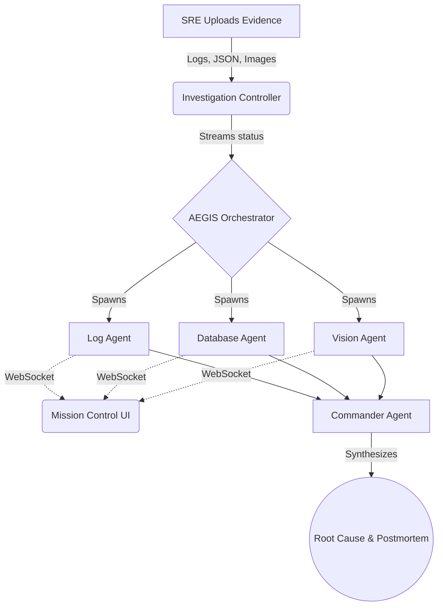

<div align="center">
  
  <h1 align="center">Sentinel AI</h1>
  <p align="center">
    <strong>Autonomous Engineering Command Center & AI-Powered Incident Investigation</strong>
  </p>
  <p align="center">
    <a href="https://github.com/your-org/sentinel-ai/actions"></a>
    <a href="https://github.com/your-org/sentinel-ai/blob/main/LICENSE"></a>
    <a href="https://nodejs.org/"></a>
    <a href="https://www.docker.com/"></a>
    <a href="https://reactjs.org/"></a>
  </p>
</div>

<br />

## 📖 The Problem

Modern software architectures are incredibly complex. When a P0 incident strikes a microservices environment, Site Reliability Engineers (SREs) and DevOps engineers are forced to manually stitch together clues from Datadog metrics, Splunk logs, GitHub commits, and AWS dashboards.

The cognitive load is immense, and the Mean Time to Resolution (MTTR) directly correlates with massive revenue loss. **Datadog tells you something is broken, but it doesn't tell you *why*.**

## 💡 The Solution

**Sentinel AI** is an AI-first operating system that acts as an autonomous Level 3 SRE. 
When an incident occurs, you upload your raw logs, metrics, and architecture diagrams into the Sentinel platform. 

The **AEGIS Engine** (Autonomous Evidence Gathering & Intelligent Synthesis) spawns a swarm of specialized AI Agents (Log Detective, Network Analyst, Database Expert) that read through your evidence in parallel. They stream their thoughts in real-time, synthesize the data, and output a highly accurate root cause, business impact analysis, and actionable remediation steps—all in under 15 seconds.

---

## ✨ Features

- **AEGIS Multi-Agent Workflow**: 9 distinct AI agents (including Vision Agents for architecture diagrams) that investigate evidence concurrently.
- **Real-Time Streaming**: Watch the AI "think" live as it parses thousands of log lines via WebSockets.
- **Instant Postmortems**: Auto-generates blameless postmortem reports with chronological incident timelines.
- **Business Impact Quantification**: Calculates exactly how many users were affected and the estimated revenue lost.
- **Integrations Hub**: Dispatch the root cause analysis directly to **Slack** or generate a **Jira** bug ticket with a single click.
- **Enterprise UI**: A stunning, high-performance dark-mode interface built with Material UI v9, Framer Motion, and Recharts.

---

## 🏗 Architecture Overview

Sentinel AI is built for enterprise scale, using a robust, highly-optimized tech stack.

### Technology Stack
- **Frontend**: React 18, Vite (with manual chunk splitting), Material UI, Framer Motion, React Flow, React Query.
- **Backend**: Node.js 24+, Express, Zod (Validation), Socket.io (Real-time).
- **Database**: PostgreSQL 16 (Raw SQL queries via `pg-pool` for maximum performance).
- **AI Integration**: OpenAI GPT-4o (`openai` SDK).
- **Deployment**: Docker, Docker Compose (Multi-stage builds, Nginx alpine server).

### The AEGIS Pipeline


---

## 🚀 Quick Start (Docker)

The fastest way to run Sentinel AI locally is via Docker Compose.

```bash
# 1. Clone the repository
git clone https://github.com/your-org/sentinel-ai.git
cd sentinel-ai

# 2. Add Environment Variables
cp .env.example .env
# Edit .env and add a JWT_SECRET

# 3. Build and run
docker-compose -f docker-compose.prod.yml up --build -d
```
Visit `http://localhost` in your browser. The frontend is served via an optimized Nginx container, and the backend runs on `http://localhost:8080`.

---

## 💻 Local Development

If you wish to run the stack bare-metal without Docker:

### Prerequisites
- Node.js v24+
- PostgreSQL v16+

### Setup Database
```bash
psql -U postgres -c "CREATE DATABASE sentinel_ai;"
psql -U postgres -d sentinel_ai -f database/migrations/001_init.sql
psql -U postgres -d sentinel_ai -f database/migrations/002_schema_expansion.sql
psql -U postgres -d sentinel_ai -f database/migrations/003_evidence_upgrade.sql
psql -U postgres -d sentinel_ai -f database/migrations/004_settings.sql
```

### Run Backend
```bash
cd server
npm install
npm run dev
```

### Run Frontend
```bash
cd client
npm install
npm run dev
```
Visit `http://localhost:5173`.

---

## 🛡️ Security Features

Sentinel AI was built with security in mind from day one:
- **Helmet.js** configured on the Express API.
- **Rate Limiting** heavily applied to all Auth and Upload endpoints to prevent DDoS and brute-force.
- **JWT Authentication** with bcrypt password hashing (12 rounds).
- **Graceful Shutdown** logic implemented to prevent database connection leaks.
- **Zod Validation** on all critical request bodies.

---

## 📚 Documentation

Detailed documentation can be found in the `/docs` folder:
- [API Documentation](docs/API.md) - Complete REST API reference.
- [Socket Events](docs/SOCKETS.md) - Real-time event streaming guide.
- [Architecture](docs/ARCHITECTURE.md) - System design and folder structure.
- [Deployment Guide](docs/DEPLOYMENT.md) - How to deploy to Vercel, Render, and Neon.

---

## 🧪 Testing

We use the native `node:test` runner. To run the test suite:
```bash
cd server
npm install
npm test
```
*Current Coverage: 15 passing tests across Auth, JWT constraints, Investigation pipelines, and Validation.*

---

## 🏆 Hackathon Notes

This project was built for a hackathon. 
- **Demo Mode**: We have included 10 pre-loaded incident scenarios (e.g., Redis Exhaustion, DNS Failure). The system uses real simulated evidence payloads (`demo-data/`) to demonstrate the AI workflow instantly without requiring an OpenAI API Key.
- To enable true generative AI mode, supply an `OPENAI_API_KEY` in the `.env` file and set `AI_MODE=openai`.

---

## 🤝 Contributing

Please see our [Contributing Guide](CONTRIBUTING.md) and [Code of Conduct](CODE_OF_CONDUCT.md).

## 📄 License

This project is licensed under the [MIT License](LICENSE).
